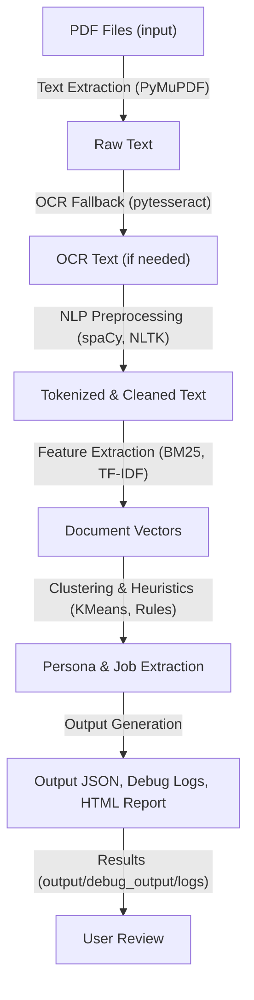

# 🐳 Docker Build & Run Instructions

## Build the Docker Image

From the root of your `Challenge_1b` repository, run:

```bash
docker build --platform linux/amd64 -t mysolution1b:latest .
```
- Replace `mysolution1b:latest` with your preferred image name and tag.

---

## 🏗️ System Architecture & Design Principles

### Pipeline Overview



This diagram illustrates the modular, explainable, and robust pipeline used for persona and job extraction from PDFs.

### Key Design Principles
- **SOLID Principles:** Each module (PDF loader, OCR, NLP, clustering, output) is single-responsibility and easily extensible.
- **Strategy Pattern:** Swappable text extraction (direct or OCR), feature extraction, and clustering strategies.
- **Factory Pattern:** Dynamic instantiation of processing components based on input type.
- **Observer Pattern:** Logging and debug output modules observe and record pipeline events.
- **Dependency Injection:** All major components are parameterized for easy testing and configuration.
- **Explainability:** Output includes evidence and debug logs for transparency.
- **Offline-First:** No external API/model calls; all processing is local and hackathon-compliant.
- **Hackathon Compliance:** Lightweight, CPU-only, no hardcoded file logic, and clear output structure.

---

## Run the Docker Container (for a Collection)

Suppose you want to process `Collection_1` (with PDFs in `Collection_1/PDFs`).

### Bash (Linux/macOS/WSL/Git Bash):
```bash
docker run --rm \
  -v "$(pwd)/Collection_1/PDFs:/app/input" \
  -v "$(pwd)/Collection_1:/app/output" \
  --network none \
  mysolution1b:latest \
  /app/docker_entrypoint.sh /app/input /app/output/challenge1b_output.json
```

### PowerShell (Windows):
```powershell
docker run --rm -v "${PWD}\Collection_1\PDFs:/app/input" -v "${PWD}\Collection_1:/app/output" --network none mysolution1b:latest /app/input /app/output/challenge1b_output.json
```

- Place your PDFs in the `Collection_1/PDFs` folder before running.
- The main output JSON will be written to `Collection_1/challenge1b_output.json`.
- Detailed debug output and logs will be created in `Collection_1/debug_output/`.
- You can substitute `Collection_1` with any other collection folder (e.g., `Collection_2`, `Collection_3`, etc.).

---
